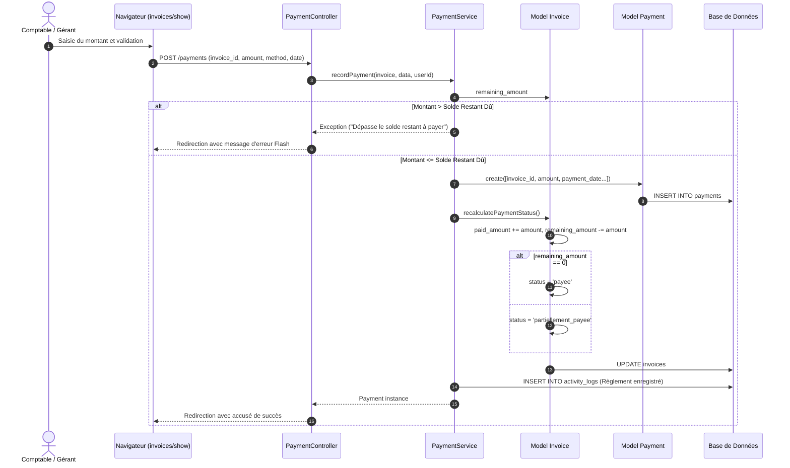
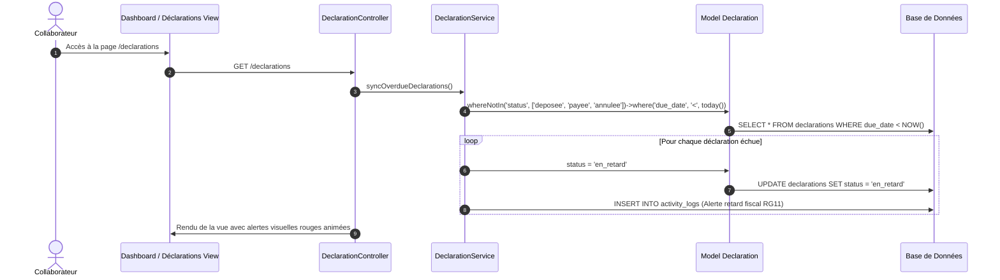

# LIVRABLE 7 : DOCUMENTATION TECHNIQUE DE L'APPLICATION

**Projet :** FiducialPro - Système Intégré de Gestion de Cabinet Fiduciaire  
**Version :** 1.0.0 Production-Ready  
**Framework :** Laravel 12.x (PHP 8.2+)  
**Environnement :** XAMPP / Apache / SQLite & MySQL  

---

## 1. Architecture Logicielle & Choix Technologiques

L'application est conçue selon le patron d'architecture **MVC (Modèle - Vue - Contrôleur)** complété par une couche **Service Layer** (patron d'injection de dépendances) afin d'isoler la logique métier critique (calculs financiers, vérifications de soldes, synchronisation des retards fiscaux) des contrôleurs HTTP.

```
                  [ Navigateur Client ]
                           │
                           ▼ (Requête HTTP / HTTPS)
                    [ routes/web.php ]
                           │
                           ▼ (Middleware : Role & Auth)
                 [ CheckRole Middleware ]
                           │
                           ▼
                 [ App\Http\Controllers ]
                 (Client, Invoice, Dossier...)
                  /                      \
                 ▼                        ▼
        [ Services Métier ]       [ Eloquent Models ]
   (PaymentService, InvoiceService)  (Client, Invoice, etc.)
                 \                        /
                  ▼                      ▼
               [ Base de Données Relational ]
                  (SQLite / MySQL / MariaDB)
```

### Pile Technique :
- **Backend :** Laravel 12.x, PHP 8.2.12.
- **Frontend :** Tailwind CSS (palette corporate ardoise et bleu roi), Alpine.js pour la réactivité sans rechargement (lignes dynamiques de facture, onglets client, modales), FontAwesome 6.5.
- **Data Visualisation :** Chart.js pour les 4 graphiques analytiques (chiffre d'affaires mensuel, répartition des dossiers, statut des factures, typologie déclarations).
- **Génération PDF :** `barryvdh/laravel-dompdf` (version 3.1.2) avec feuilles de style optimisées au format A4 pour les factures d'honoraires et rapports d'activité.
- **Base de Données :** Schéma relationnel 3NF avec contraintes d'intégrité référentielle, clés étrangères et index de performance.

---

## 2. Implémentation des Règles de Gestion Métier (RG01 à RG16)

| Règle | Intitulé & Périmètre | Fichier d'Implémentation | Description Technique |
| :--- | :--- | :--- | :--- |
| **RG01** | Unicité du client & Identifiants | `app/Models/Client.php`, `ClientController.php` | Validation stricte de l'ICE (15 chiffres), IF, RC et forme juridique marocaine (SARL, SA, SARL AU). |
| **RG02** | Suppression logique & intégrité comptable | `Client.php`, `Dossier.php`, `Invoice.php`, `ClientController.php`, `TrashController.php` | Trait `SoftDeletes` : les fiches ne sont jamais physiquement effacées. Un client rattaché à des factures, règlements ou déclarations **ne peut pas être supprimé** (l'archivage est imposé) afin qu'aucune pièce comptable ne devienne orpheline ; les relations `client()`/`dossier()` sont déclarées `withTrashed()` pour qu'une facture conserve toujours l'identité de son débiteur. La **corbeille** (`/corbeille`, réservée Admin/Gérant) rend l'historique consultable et restaurable, chaque restauration étant tracée au journal d'audit. |
| **RG03** | Référence unique de dossier | `app/Services/InvoiceService.php`, `DossierController.php` | Génération automatique et séquentielle sous le masque `DOS-YYYY-XXXX`. |
| **RG04** | Affectation collaborative N:N | `app/Models/DossierEmployee.php`, `DossierController.php` | Table pivot `dossier_employees` avec attributs `role_in_dossier` et `assigned_date`. |
| **RG05** | Responsable de mission | `app/Models/Dossier.php` | Clé étrangère `responsible_id` vers `employees` avec contrôle d'affichage. |
| **RG06** | Numérotation continue des factures | `app/Services/InvoiceService.php` | Séquence chronologique `FAC-YYYY-XXXX` sans rupture de numérotation, garantie par une contrainte d'unicité en base : en cas d'émission simultanée de deux factures, la référence est régénérée et l'enregistrement retenté (jusqu'à 5 fois) plutôt que de renvoyer une erreur. |
| **RG07** | Calcul arithmétique HT/TVA/TTC | `app/Models/InvoiceItem.php`, `Invoice.php`, `config/cabinet.php` | `total_ht = quantity * unit_price`, `total_ttc = total_ht * (1 + tax_rate/100)`. Seuls les taux de TVA légaux marocains (20, 14, 10, 7, 0 %) sont acceptés. Ventilation de la TVA par taux (`Invoice::tax_breakdown`) affichée sur la facture dès qu'un document mêle plusieurs taux. |
| **RG08** | Contrôle strict du solde restant dû | `app/Services/PaymentService.php`, `PaymentController.php`, `Invoice.php` | Vérification `amount <= remaining_amount` sous verrou pessimiste. Levée d'une exception `\Exception` en cas de tentative de sur-paiement. Mise à jour synchrone du statut : `emise` -> `partiellement_payee` -> `payee`. La date d'encaissement ne peut être ni postdatée ni antérieure à l'émission de la facture. |
| **RG09** | Télédéclarations SIMPL & Périodicités | `app/Models/Declaration.php`, `DeclarationType.php` | Périodicités trimestrielle (TVA), mensuelle (IR, CNSS), annuelle (IS, 9421). |
| **RG10** | Preuve de dépôt SIMPL | `app/Http/Controllers/DeclarationController.php`, `DeclarationPolicy.php` | Validation par date effective (jamais postdatée) et numéro officiel de reçu SIMPL/DGI. Le télé-dépôt engageant le cabinet auprès de la DGI, il est réservé aux profils Comptable, Gérant et Administrateur. |
| **RG11** | Détection automatique des retards fiscaux | `app/Services/DeclarationService.php` | Méthode `syncOverdueDeclarations()` exécutée à chaque consultation du dashboard et des déclarations : bascule à `en_retard` dès que `due_date < today()`. |
| **RG12** | Archivage GED & Rattachement | `app/Services/DocumentService.php`, `DocumentController.php` | Contrôle de taille (max 10 Mo), double filtrage MIME — extension déclarée **et** signature binaire réelle du fichier via `finfo` (empêche un fichier renommé de contourner le filtre) — et rattachement obligatoire à un client ou dossier. |
| **RG13** | Alertes et échéancier mensuel | `app/Http/Controllers/DeadlineController.php` | Filtrage par date, bascule de statut de jalon et rappels proactifs. |
| **RG14** | Journal d'audit et traçabilité | `app/Models/ActivityLog.php`, `ActivityLogController.php` | Méthode statique `ActivityLog::log()` consignant l'utilisateur, le module, l'action, l'adresse IP et l'empreinte User-Agent. |
| **RG15** | Contrôle d'accès RBAC | `app/Http/Middleware/CheckRole.php` + `app/Policies/{Client,Dossier,Employee,Declaration,Document}Policy.php` | Le middleware sécurise l'accès aux modules sensibles (administration, opérations financières) ; les Policies Laravel appliquent, action par action (créer/modifier/supprimer), la matrice exacte du §4 — ex. le Comptable peut modifier un client mais pas le créer ni le supprimer. Vues Blade gardées par `@can` en cohérence avec le backend. Authentification protégée contre la force brute : blocage de 5 minutes après 5 tentatives échouées (clé `email + IP`), chaque échec étant tracé au journal d'audit. Garde-fous d'administration : un administrateur ne peut ni se rétrograder ni se désactiver lui-même, et le système conserve toujours au moins un administrateur actif (protection contre le verrouillage total du cabinet). |
| **RG16** | Exports comptables & fiscaux | `app/Http/Controllers/ReportController.php`, `app/Services/ExcelReportService.php` | Classeurs **Excel natifs (.xlsx)** générés via PhpSpreadsheet (en-tête cabinet, colonnes formatées DH/date, bandes zébrées, ligne de totaux) et rapports de synthèse PDF A4 via DomPDF. |

---

## 3. Diagrammes de Séquence

### Séquence 1 : Enregistrement d'un règlement sur facture (RG07 & RG08)



### Séquence 2 : Synchronisation automatique des retards déclaratifs (RG11)



---

## 4. Matrice des Droits d'Accès (RBAC)

| Module / Ressource | Administrateur | Gérant | Chef de Mission / Comptable | Secrétaire |
| :--- | :---: | :---: | :---: | :---: |
| **Tableau de Bord & KPIs** | Lecture / Analytique | Lecture / Analytique | Lecture / Opérationnel | Lecture Restreinte |
| **Gestion des Clients** | Total (C/R/U/D/Archive) | Total (C/R/U/D/Archive) | Lecture & Modification | Lecture & Création |
| **Dossiers & Affectations** | Total | Total | Gestion & Affectation | Consultation |
| **Déclarations Fiscales** | Total | Total | Saisie & Télé-dépôt | Consultation |
| **Facturation des Honoraires**| Total | Total | Consultation & Émission | Consultation |
| **Encaissements & Règlements**| Total | Total | Validation & Reçus | Consultation |
| **Archivage GED** | Total (dont suppression) | Total (dont suppression) | Dépôt & Téléchargement | Dépôt & Téléchargement |
| **Rapports & Exports** | PDF & Excel | PDF & Excel | PDF & Excel | Non autorisé |
| **Gestion des Collaborateurs (RH)** | Total | Total | Consultation seule | Consultation seule |
| **Corbeille & Restauration** | Total | Total | Non autorisé | Non autorisé |
| **Administration Utilisateurs**| Total | Consultation | Non autorisé | Non autorisé |
| **Journal d'Audit (RG14)** | Consultation totale | Consultation totale | Consultation restreinte | Non autorisé |
